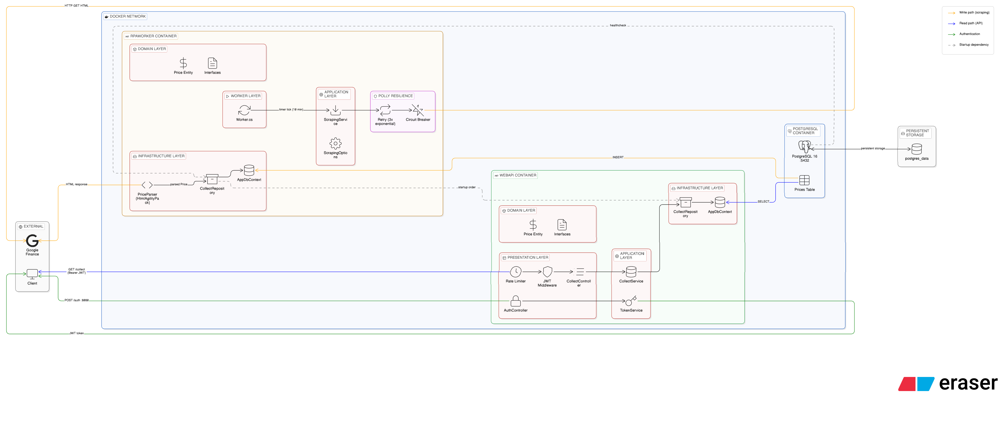

# RPA Data Collector


## Visão Geral

Sistema automatizado que captura e disponibiliza dados externos, composto por dois serviços independentes em C# .NET 10, orquestrados via Docker Compose.

- **RPA Worker:** Background Service que acessa periodicamente o Google Finance, extrai a cotação do dólar (USD-BRL) via parsing de HTML e persiste os dados no PostgreSQL.
- **Web API:** API RESTful que expõe os dados coletados com autenticação JWT, rate limiting e documentação via Swagger.

---

## Arquitetura
O diagrama abaixo ilustra a arquitetura completa do sistema.



### Fluxo do RPA Worker

```
Worker Loop (a cada 1 min)
    ↓
HttpClient + User-Agent
    ↓ (Polly: Retry 3x + Circuit Breaker)
Google Finance HTML
    ↓
HtmlAgilityPack Parser
    ↓
Repository → PostgreSQL
```


### Fluxo da Web API

```
Request → Rate Limiter → JWT Middleware → Controller → Service → Repository → PostgreSQL
                                                            ↓
                                                      (mapeia para DTO)
                                                            ↓
                                                        Response
```
 
---

## 🛠️ Tecnologias

| Tecnologia | Uso |
|---|---|
| C# / .NET 10 | Linguagem e framework |
| PostgreSQL 16 | Banco de dados |
| Docker + Compose | Containerização e orquestração |
| EF Core 10 | ORM e migrations |
| Polly | Resiliência (Retry + Circuit Breaker) |
| HtmlAgilityPack | Parsing de HTML |
| JWT Bearer | Autenticação da API |
| Rate Limiting | Proteção contra abuso (nativo .NET 10) |
| Swagger / OpenAPI | Documentação da API |
| xUnit + Moq | Testes automatizados |
| GitHub Actions | CI/CD |
 
---

## Como Rodar

### Pré-requisitos

- [Docker](https://docs.docker.com/get-docker/) e Docker Compose instalados
- Git
- .NET 10 SDK

### Passo a passo

**1. Clone o repositório**
```bash
git clone https://github.com/carloswps/rpa-data-collector.git
cd rpa-data-collector
```

**2. Configure as variáveis de ambiente**
```bash
cp .env.example .env
```

**3. Edite o `.env` com seus valores**

```env
# Postgres                                           
POSTGRES_USER=rpa_user                                
POSTGRES_PASSWORD=rpa_pass                                 
POSTGRES_DB=rpa_db    

# Scraping
SCRAPING_URL=https://www.google.com/finance/quote/USD-BRL
SCRAPING_INTERVAL_MINUTES=1

# JWT                                                
JWT_SECRET=sua_chave_secreta_minimo_32_caracteres
JWT_ISSUER=rpa-api                                          
JWT_AUDIENCE=rpa-clients   

```

**4. Suba os serviços**
```bash
# Docker Compose V2 (recomendado)
docker compose up --build

# Docker Compose V1 (caso o comando acima não funcione)
docker-compose up --build
```

O sistema irá automaticamente:
- Subir o PostgreSQL com healthcheck
- Aplicar as migrations do banco de dados
- Iniciar o RPA Worker (coleta a cada 1 minuto)
- Iniciar a Web API na porta 8080

**5. Acesse o Swagger**
```
http://localhost:8080/swagger
```

> ℹ️ O intervalo de coleta está configurado para **1 minuto** para facilitar
> a visualização do Worker em funcionamento durante a avaliação.
> Em produção, recomenda-se aumentar para 10 minutos ou mais. 

---

## 🔐 Autenticação

A API utiliza JWT Bearer Authentication. Para acessar os endpoints protegidos:

**1. Gere o token**
```
POST /api/auth/authenticate
Body: { "username": "teste", "password": "admin" }
```

**2. Autorize no Swagger**

Copie o token retornado, clique em **Authorize** no Swagger e informe `Bearer {token}`.
 
---

### Endpoints disponíveis

| Método | Rota | Auth | Descrição |
|--------|------|------|-----------|
| POST | `/api/auth/authenticate` | ❌ | Gera o token JWT |
| GET | `/api/v1/collect` | ✅ | Lista todas as coletas |
| GET | `/api/v1/collect/{id}` | ✅ | Busca coleta por ID |
| GET | `/api/v1/collect/latest` | ✅ | Coleta mais recente |

---


## 🧪 Testes

Para executar os testes:

```bash
dotnet test
```

A suíte cobre os componentes críticos do sistema:

- **Parser** — validação de HTML válido, inválido e mudanças de layout
- **ScrapingService** — orquestração do fluxo de coleta
- **Controllers** — autenticação e contratos dos endpoints
---

## ⚙️ CI/CD

O projeto utiliza GitHub Actions para integração contínua. A cada push nas branches `main` e `dev`:

- Build e testes executados em Ubuntu e Windows via matrix strategy
- Imagens Docker construídas e validadas
- Pipeline só avança para o build Docker se todos os testes passarem
---

## Decisões Arquiteturais

**PostgreSQL ao invés de banco em memória**
O desafio permite banco em memória, mas optei pelo PostgreSQL para simular um ambiente real de produção. Com a containerização eliminamos qualquer overhead de configuração local entre diferentes ambientes de desenvolvimento.

**Repository Pattern**
Desacopla a lógica de negócio do mecanismo de persistência, facilitando testes unitários via mocking e permitindo trocar o banco sem alterar as camadas superiores da aplicação.

**Polly para resiliência**
O Worker utiliza Retry com Exponential Backoff (3 tentativas: 2s, 4s, 8s) e Circuit Breaker (abre após 5 falhas consecutivas, aguarda 30s antes de tentar novamente). Isso garante que falhas temporárias de rede não derrubem o serviço.

**Parser**
O `PriceParser` nunca lança exceção para o chamador. Qualquer falha — HTML vazio, layout alterado, valor não numérico — resulta em lista vazia com `LogWarning`. O Worker permanece vivo independentemente do estado da fonte de dados.

**DTOs na API**
As entidades do banco nunca são expostas diretamente. O mapeamento manual para DTOs evita vazamento de dados internos e desacopla o contrato da API do modelo de persistência.

**Options Pattern**
Configurações do Worker (`Url`, `IntervalMinutes`) são tipadas via `ScrapingOptions` e injetadas pelo sistema de configuração do .NET. Isso torna as configurações testáveis e elimina strings hardcoded no código.

**JWT Bearer + Rate Limiting nativo**
Autenticação JWT para a API RESTful. Rate Limiting com Fixed Window (10 req/10s) usando a implementação nativa do .NET 10, sem dependências externas.

**Migrations automáticas no startup**
O Worker executa `MigrateAsync` na inicialização, garantindo que o schema do banco esteja sempre atualizado sem intervenção manual ao rodar `docker compose up`.

**Porta do PostgreSQL exposta**
A porta `5432` está exposta para facilitar a inspeção dos dados durante a avaliação. Em produção, recomenda-se remover o mapeamento e acessar o banco apenas pela rede interna do Docker.
 
---

## O que Melhoraria com Mais Tempo

- **Múltiplas fontes de dados** com uma interface configurável, permitindo adicionar novas fontes sem alterar o core do Worker
- **Observabilidade** com OpenTelemetry para rastreamento distribuído, métricas e correlação de logs entre os dois serviços
- **Cache com Redis** na Web API para reduzir queries ao banco em endpoints de leitura frequente
- **Health checks na API** expondo `/health` para monitoramento externo e integração com orquestradores como Kubernetes
- **Autenticação com tabela de usuários** substituindo as credenciais hardcoded no appsettings, com hash de senha via BCrypt
- **Projeto Infrastructure separado** responsável pela infraestrutura do sistema, único ponto de contato direto com o banco de dados
- **Anti-Bot Fingerprinting** com headers dinâmicos e rotação de User-Agents para evitar bloqueios por comportamento padrão de scraping
- **Secret Management** para armazenar credenciais de acesso externo de forma segura

---

## 📁 Estrutura do Projeto

```
rpa-data-collector/
├── compose.yaml
├── .env.example
├── .github/
│   └── workflows/
│       └── ci.yml
├── doc/
│   └── rpa-diagram.png
├── WebApi/
│   ├── Dockerfile
│   ├── Controllers/
│   ├── Application/
│   ├── Domain/
│   ├── Infrastructure/
│   └── DTOs/
├── RpaWorker/
│   ├── Dockerfile
│   ├── Worker.cs
│   ├── Application/
│   ├── Domain/
│   ├── Infrastructure/
│   └── Migrations/
├── RpaWorker.Tests/
└── WebApi.Tests/
```
 